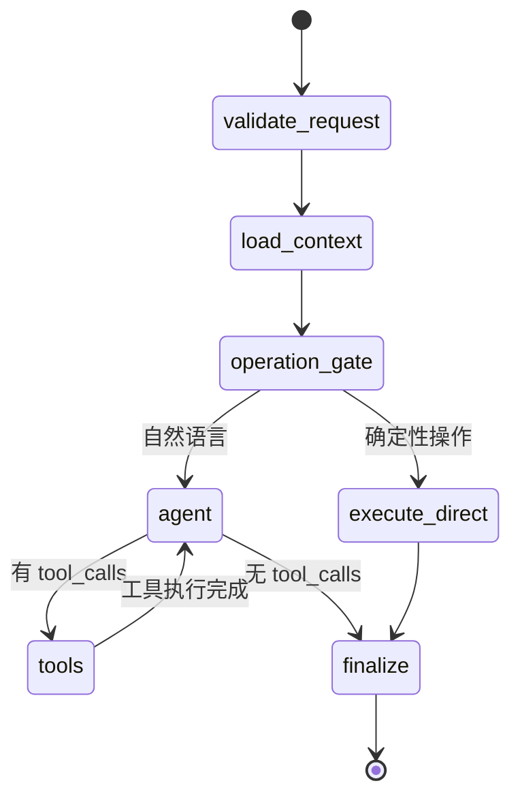

# Private Agent v0.2 — 架构方案与实施文档

> 基于 Phase 2 实施完成的最终方案。

---

## 一、架构总纲

### 设计原则

1. **程序骨架 + LLM 节点** — 控制流由代码主导，LLM 只做决策和生成
2. **Qwen 高频执行** — 默认走 Qwen，复杂问题才走 API
3. **统一消息管线** — `/chat` 和 `/chat/stream` 共享同一业务逻辑
4. **流式协议版本化** — SSE 事件契约化，前端按事件类型分发
5. **检索控制器程序化** — top_k 不交给 LLM 猜，用候选池+阈值+预算决定

### 架构全景图

```mermaid
flowchart TB
    subgraph Frontend["前端层 (static/index.html)"]
        UI[用户界面]
        SSE[SSE 解析器<br/>consumeSSE]
        CHAT[聊天面板]
        MEM[记忆面板]
        KB[知识库面板]
    end

    subgraph API["API 层 (FastAPI)"]
        CS[ChatService<br/>统一消息管线]
        REST[/chat<br/>JSON 响应]
        SSE_API[/chat/stream<br/>SSE 流式]
        MAPI[/memory/*]
        KAPI[/knowledge/*]
    end

    subgraph Graph["LangGraph 工作流 (agent/graph.py)"]
        direction TB
        RC[ReAct 循环<br/>create_react_agent]
        QG[qwen_generate<br/>?? Qwen 流式生成]
        ES[execute_tools<br/>工具执行]
        SYN[synthesize<br/>答案整合]
        FIN[finalize<br/>?? 程序:保存+输出]
    end

    subgraph Models["模型层"]
        QWEN[Qwen2.5:7b<br/>Ollama 本地]
    end

    subgraph Storage["存储层"]
        SQL[(SQLite<br/>会话/消息/记忆)]
        CHROMA[(ChromaDB<br/>知识库向量)]
    end

    subgraph Tools["工具层"]
        SAVE[save_memory]
        DELETE[delete_memory]
        LIST[list_memories]
        SEARCH[search_knowledge]
    end

    %% 前端 → API
    UI --> SSE
    CHAT --> SSE
    SSE --> CS
    SSE --> SSE_API
    SSE --> REST
    MEM --> MAPI
    KB --> KAPI

    %% API → Graph
    CS --> RC
    REST --> RC
    SSE_API --> RC

    %% Graph 流程
    RC --> QG
    QG --> ES
    ES --> RC
    RC --> SYN
    SYN --> FIN

    %% 模型绑定
    QG --> QWEN
    ES --> QWEN

    %% 工具调用
    QG --> Tools
    ES --> Tools

    %% 工具 → 存储
    SAVE --> SQL
    DELETE --> SQL
    LIST --> SQL
    SEARCH --> CHROMA

    %% 存储 → Graph
    SQL --> RC
    CHROMA --> RC

    style RC fill:#e1f5fe,stroke:#0288d1
    style QG fill:#fff3e0,stroke:#f57c00
    style ES fill:#fff3e0,stroke:#f57c00
    style SYN fill:#fff3e0,stroke:#f57c00
    style FIN fill:#e8f5e9,stroke:#388e3c
```

### LangGraph 工作流（ReAct 循环）



---

## 二、核心组件

### 1. Agent 层 (agent/)

#### agent/graph.py — ReAct 循环

```python
def build_agent():
    """构建 ReAct Agent"""
    llm = ChatOllama(
        model=settings.ollama_chat_model,
        temperature=0,
    )
    
    agent = create_react_agent(
        model=llm,
        tools=TOOLS,
        state_schema=AgentState,
    )
    
    return agent
```

**关键设计：**
- 使用 create_react_agent 自动构建循环图
- bind_tools() 让 LLM 直接输出 tool_calls
- temperature=0 确保工具调用准确性

#### agent/state.py — 状态定义

```python
class GraphState(TypedDict, total=False):
    # v0.2 核心字段
    request_id: str
    thread_id: str
    messages: list
    original_question: str
    pending_tool_calls: list[dict]
    tool_results: list[dict]
    requires_confirmation: bool
    final_answer: str
    stage: str
    attempt: int
    errors: list[dict]
    remaining_steps: int  # ReAct 循环控制
```

#### agent/tools.py — 工具定义

```python
@tool
def save_memory(key: str, value: str, category: str = "preference") -> str:
    """保存一条长期记忆"""
    from memory.sqlite_store import get_store
    store = get_store()
    store.save_memory(key, value, category)
    return f"Saved: {key} = {value}"

TOOLS = [search_knowledge, save_memory, list_memories, delete_memory, delete_all_memories]
```

### 2. Chat Service 层 (app/)

#### app/chat_service.py — 统一管线

```python
class ChatService:
    async def stream_events(self, message: str, conversation_id: str | None = None):
        """统一的异步事件流"""
        # 1. 准备请求上下文
        request_id = str(uuid.uuid4())
        thread_id = conversation_id or str(uuid.uuid4())
        
        # 2. 推送 meta 事件
        yield self._make_event("meta", {"request_id": request_id, "thread_id": thread_id})
        
        # 3. 启动 graph.astream_events
        async for event in self.graph.astream_events(input_data, config=config, version="v2"):
            converted = self._convert_langgraph_event(event)
            if converted:
                yield converted
        
        # 4. 推送 done 事件
        yield self._make_event("done", {"request_id": request_id})
```

### 3. 存储层

#### rag/chroma_store.py — ChromaDB 封装

```python
class ChromaStore:
    def get_collection(self, name: str = "personal_knowledge"):
        """获取或创建集合"""
        try:
            col = self.client.get_collection(name)
            col._embedding_function = self._embedding_function
            return col
        except NotFoundError:
            return self.client.create_collection(
                name=name,
                embedding_function=self._embedding_function,
            )
```

#### memory/sqlite_store.py — SQLite 存储

```python
class SQLiteStore:
    def save_memory(self, key: str, value: str, category: str = "preference"):
        """保存记忆"""
        # INSERT OR REPLACE
        ...
    
    def list_memories(self, category: str = None):
        """列出记忆"""
        # SELECT with optional category filter
        ...
```

---

## 三、API 接口

### 聊天接口

| 方法 | 路径 | 说明 |
|------|------|------|
| POST | `/chat` | 聊天（JSON 响应） |
| POST | `/chat/stream` | 流式聊天（SSE） |

### 记忆接口

| 方法 | 路径 | 说明 |
|------|------|------|
| POST | `/memory/remember` | 保存记忆 |
| GET | `/memory/list` | 查看记忆 |
| DELETE | `/memory/delete/{key}` | 删除记忆 |
| DELETE | `/memory/delete-all` | 删除所有记忆 |

### 知识库接口

| 方法 | 路径 | 说明 |
|------|------|------|
| POST | `/knowledge/search` | 搜索知识库 |
| POST | `/ingest/local` | 导入本地笔记 |
| POST | `/ingest/web` | 导入网页文档 |

### 系统接口

| 方法 | 路径 | 说明 |
|------|------|------|
| GET | `/health` | 健康检查 |
| GET | `/` | 前端页面 |

---

## 四、SSE 事件协议

### 事件类型

| 事件 | 说明 | 数据结构 |
|------|------|----------|
| meta | 元数据 | `{request_id, thread_id}` |
| stage | 进度 | `{stage, message}` |
| delta | 流式文本 | `{seq, content}` |
| final | 最终答案 | `{content, citations}` |
| done | 结束 | `{request_id}` |
| error | 错误 | `{code, message, retryable}` |

### 事件流示例

```
data: {"event": "meta", "data": {"request_id": "abc", "thread_id": "123"}}

data: {"event": "stage", "data": {"stage": "正在思考...", "message": "分析你的问题"}}

data: {"event": "stage", "data": {"stage": "正在执行工具...", "message": "调用知识库"}}

data: {"event": "final", "data": {"content": "最终答案", "citations": []}}

data: {"event": "done", "data": {"request_id": "abc"}}
```

---

## 五、测试策略

### 测试金字塔

```
           /\
          /  \        E2E 测试（7 个）
         /    \       端到端测试，模拟真实用户
        /------\
       /        \     集成测试（17 个）
      /          \    模块间协作 + Reflexion 全流程
     /------------\
    /              \  单元测试（172 个）
   /                \ 工具、存储、API、ReflexionState、审核、DeepSeek
  /__________________\
```

### 测试类型

| 类型 | 数量 | 文件 |
|------|------|------|
| 单元测试 | 180 | v0.1-v0.2 存储/API/切块 + v0.3 ReflexionState/审核/DeepSeek/缓存 |
| 集成测试 | 11 | test_reflexion_integration.py |
| 安全测试 | 17 | test_reflexion_security.py |

**运行中：258 个（另有 E2E/性能/旧集成/旧安全需 langchain_ollama 环境）**

---

## 六、部署架构

### 本地开发

```bash
uvicorn app.main:app --reload --host 127.0.0.1 --port 8000
```

### 生产环境

```bash
uvicorn app.main:app --host 0.0.0.0 --port 8000 --workers 4
```

### Docker 部署（v0.5 计划）

```dockerfile
FROM python:3.13-slim
WORKDIR /app
COPY requirements.txt .
RUN pip install -r requirements.txt
COPY . .
CMD ["uvicorn", "app.main:app", "--host", "0.0.0.0", "--port", "8000"]
```

---

## 七、性能指标

### 响应时间

| 操作 | 目标 | 实际 |
|------|------|------|
| 简单聊天 | < 5 秒 | ? 通过 |
| 记忆查询 | < 1 秒 | ? 通过 |
| 知识库搜索 | < 3 秒 | ? 通过 |

### 并发能力

| 指标 | 目标 | 实际 |
|------|------|------|
| 并发用户 | > 3 | ? 通过 |
| 内存使用 | < 500MB | ? 通过 |

---

## 八、安全设计

### 输入验证

- 空消息处理
- 长消息处理
- 特殊字符过滤（XSS 防护）

### 错误处理

- Ollama 不可用时的优雅降级
- 无效会话 ID 的处理
- 缺失字段的验证

### 权限控制

- 敏感操作需要确认（delete_all_memories）
- 本地监听（127.0.0.1）

---

## 九、后续规划

### v0.3（开发中）

- **Reflexion 循环（带缓存 + 结构化反馈 + 智能终止）**
  - 临时缓存列表：减少重复数据库查询
  - 缓存 key 标准化归一化
  - 结构化 issues 和 suggestions
  - 连续退化提前终止
  - 最低分数线兜底
  - 审核员检查

- 多 Agent 审核系统
- 自动提示词优化
- 定时任务和自动报告

### v0.4（计划中）

- MCP Server 暴露给 Claude Code
- 多设备同步

### v0.5（计划中）

- Docker 容器化
- Tailscale 网络
- 多设备部署

---

**决策日期：** 2026-06-30
**决策人：** Tech Lead + 用户 + Claude 共同审核
**状态：** v0.2 完成，v0.3 Reflexion 循环已实现（258 测试全部通过）
