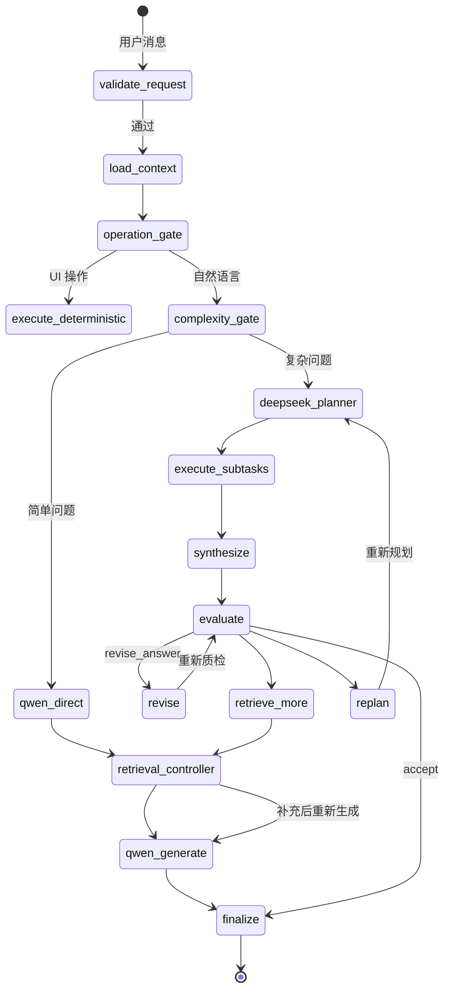
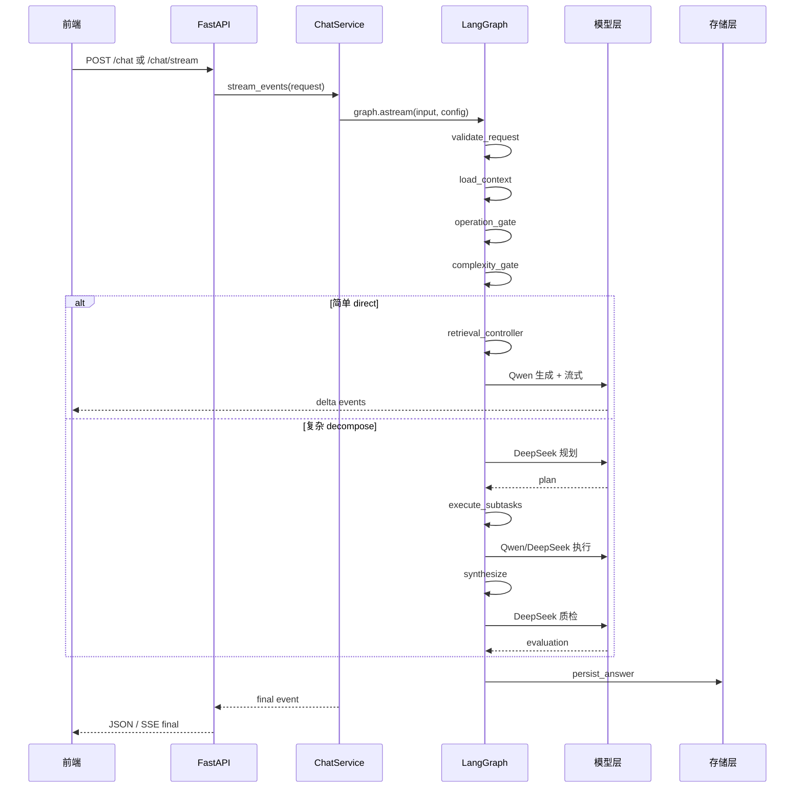
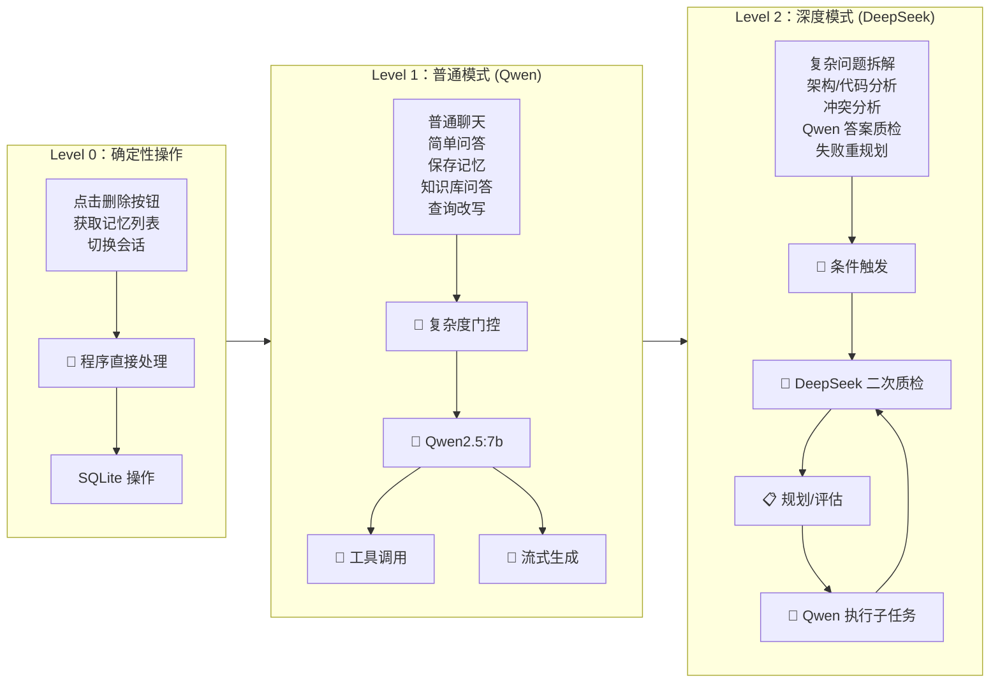
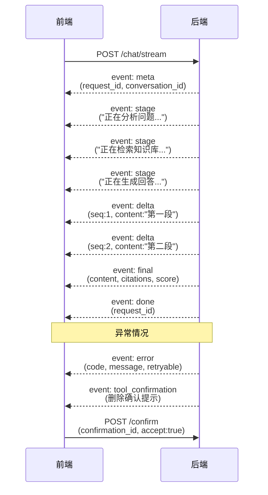

# Private Agent v0.2 — 架构方案与实施文档

> 基于 GPT 架构讨论 + 用户决策的最终方案。
>
> 决策记录：
> - 模型分层：Qwen 本地 (Ollama) + DeepSeek API
> - 实施节奏：一次性做完整方案
> - 流式策略：先发状态事件，选定最终答案后流式输出正文

---

## 一、架构总纲

### 设计原则

1. **程序骨架 + LLM 节点** — 控制流由代码主导，LLM 只做决策和生成
2. **Qwen 高频执行，DeepSeek 低频推理** — 默认走 Qwen，复杂+质检升级 DeepSeek
3. **统一消息管线** — `/chat` 和 `/chat/stream` 共享同一业务逻辑
4. **流式协议版本化** — SSE 事件契约化，前端按事件类型分发
5. **检索控制器程序化** — top_k 不交给 LLM 猜，用候选池+阈值+预算决定

### 架构全景图

```mermaid
flowchart TB
    subgraph Frontend["前端层 (static/index.html)"]
        UI[用户界面]
        SSE[SSE 解析器<br/>consumeSSE]
        CHAT[聊天面板]
        MEM[记忆面板]
        KB[知识库面板]
    end

    subgraph API["API 层 (FastAPI)"]
        CS[ChatService<br/>统一消息管线]
        REST[/chat<br/>JSON 响应]
        SSE_API[/chat/stream<br/>SSE 流式]
        MAPI[/memory/*]
        KAPI[/knowledge/*]
    end

    subgraph Graph["LangGraph 工作流 (agent/graph.py)"]
        direction TB
        V[validate_request<br/>🧩 程序:清洗/校验]
        L[load_context<br/>🧩 程序:加载历史+记忆]
        OG[operation_gate<br/>🧩 程序:UI操作检测]
        DET[确定性操作<br/>直接调 API]
        CG[complexity_gate<br/>规则+Qwen 兜底]
        RC[retrieval_controller<br/>🧩 程序:候选池→阈值→去重→预算]
        QG[qwen_generate<br/>🤖 Qwen 流式生成]
        DP[deepseek_planner<br/>🧠 DeepSeek 问题拆解]
        ES[execute_subtasks<br/>子问题执行]
        QE[qwen_executor<br/>🤖 简单子问题]
        DSE[deepseek_executor<br/>🧠 复杂子问题]
        SYN[synthesize<br/>答案整合]
        EV[evaluate<br/>🧠 DeepSeek 质检]
        ACC[accept ✅]
        REV[revise_answer<br/>Qwen 修订]
        RET[retrieve_more<br/>重新检索]
        REP[replan<br/>DeepSeek 重规划]
        FIN[finalize<br/>🧩 程序:保存+输出]
    end

    subgraph Models["模型层"]
        QWEN[Qwen2.5:7b<br/>Ollama 本地]
        DEEP[DeepSeek API<br/>云端推理]
    end

    subgraph Storage["存储层"]
        SQL[(SQLite<br/>会话/消息/记忆)]
        CHROMA[(ChromaDB<br/>知识库向量)]
    end

    subgraph Tools["工具层"]
        SAVE[save_memory]
        DELETE[delete_memory]
        LIST[list_memories]
        SEARCH[search_knowledge]
    end

    %% 前端 → API
    UI --> SSE
    CHAT --> SSE
    SSE --> CS
    SSE --> SSE_API
    SSE --> REST
    MEM --> MAPI
    KB --> KAPI

    %% API → Graph
    CS --> V
    REST --> V
    SSE_API --> V

    %% Graph 流程
    V --> L
    L --> OG
    OG -->|UI 操作| DET
    OG -->|自然语言| CG
    CG -->|简单 direct| RC
    CG -->|复杂 decompose| DP
    RC --> QG
    QG --> FIN
    DP --> ES
    ES --> QE
    ES --> DSE
    QE --> SYN
    DSE --> SYN
    SYN --> EV
    EV -->|accept| ACC
    ACC --> FIN
    EV -->|revise| REV
    REV --> EV
    EV -->|retrieve_more| RET
    RET --> RC
    EV -->|replan| REP
    REP --> DP

    %% 模型绑定
    QG --> QWEN
    QE --> QWEN
    REV --> QWEN
    DP --> DEEP
    DSE --> DEEP
    EV --> DEEP

    %% 工具调用
    QG --> Tools
    QE --> Tools

    %% 工具 → 存储
    SAVE --> SQL
    DELETE --> SQL
    LIST --> SQL
    SEARCH --> CHROMA

    %% 存储 → Graph
    SQL --> L
    CHROMA --> RC

    style V fill:#e1f5fe,stroke:#0288d1
    style L fill:#e1f5fe,stroke:#0288d1
    style OG fill:#e1f5fe,stroke:#0288d1
    style RC fill:#e1f5fe,stroke:#0288d1
    style FIN fill:#e1f5fe,stroke:#0288d1
    style QG fill:#fff3e0,stroke:#f57c00
    style QE fill:#fff3e0,stroke:#f57c00
    style REV fill:#fff3e0,stroke:#f57c00
    style DP fill:#f3e5f5,stroke:#7b1fa2
    style DSE fill:#f3e5f5,stroke:#7b1fa2
    style EV fill:#f3e5f5,stroke:#7b1fa2
    style DET fill:#e8f5e9,stroke:#388e3c
```

### LangGraph 工作流（含重试循环）



### 统一消息管线（ChatService）



### 模型分层路由



### SSE 事件协议



---

## 二、模型分层设计

### 分工矩阵

| 工作节点 | 模型 | 原因 |
|---------|------|------|
| 普通聊天/简单问答 | Qwen | 快、本地、适合流式 |
| 工具选择（记忆保存/删除） | Qwen + 规则 | 简单结构化输出 |
| 查询改写 | Qwen | 短输出、成本低 |
| 文档摘要/格式整理 | Qwen | 非推理密集型 |
| 简单 RAG 答案生成 | Qwen | 知识来自检索结果 |
| 复杂度门控 | 规则优先，Qwen 兜底 | 大部分可低成本判断 |
| 复杂问题拆解规划 | DeepSeek | 需要多步推理 |
| 架构/代码/冲突分析 | DeepSeek | 推理深度重要 |
| Qwen 答案质检 | DeepSeek | 跨模型降低同源偏差 |
| DeepSeek 答案质检 | 规则 + Qwen 覆盖检查 | 不自检 |
| 子答案整合 | Qwen（简单）/ DeepSeek（复杂） | 视复杂度 |
| 检索控制 | **程序** | 不应由 LLM 猜 top_k |
| 权限/循环/校验 | **程序** | 确定性逻辑 |

### 配置

```yaml
# config/models.yaml (或 settings.py)
models:
  fast:
    provider: ollama
    model: qwen2.5:7b
    base_url: http://127.0.0.1:11434
    roles:
      - default_chat
      - tool_selection
      - query_rewrite
      - summarization
      - rag_answer
      - final_formatting

  reasoning:
    provider: deepseek
    api_key: ${DEEPSEEK_API_KEY}
    model: deepseek-chat  # 或 deepseek-reasoner
    base_url: https://api.deepseek.com
    roles:
      - complex_planning
      - architecture_analysis
      - conflict_resolution
      - qwen_answer_evaluation
      - retry_replanning
```

---

## 三、统一聊天管线（核心架构变更）

### 当前问题

```
/chat       → run_agent() → LangGraph → JSON
/chat/stream → generate() 内联      → SSE    ← 绕过 graph
```

### 目标架构

```
HTTP Request
  │
  ▼
ChatService (共用)
  │
  ├─ stream_mode="messages" → graph.astream()
  │     │
  │     ▼
  ├─ /chat        → 收集到 final 后返回 JSON
  └─ /chat/stream → 逐 event 转 SSE
```

### 代码结构

```python
# app/chat_service.py — 新增：统一聊天服务
class ChatService:
    def __init__(self):
        self.graph = build_agent()  # LangGraph
        self.checkpointer = MemorySaver()  # 持久化 checkpointer

    async def stream_events(self, request: ChatRequest):
        """统一的异步事件流，/chat 和 /chat/stream 共用"""
        thread_id = request.conversation_id or str(uuid4())
        config = {
            "configurable": {"thread_id": thread_id},
        }
        input_data = {
            "messages": [HumanMessage(content=request.message)],
            "original_question": request.message,
            "thread_id": thread_id,
            "request_id": str(uuid4()),
        }

        async for event in self.graph.astream_events(
            input_data,
            config=config,
            version="v2",
        ):
            yield event
```

### 端点改造

```python
# app/main.py

chat_service = ChatService()

@app.post("/chat")
async def chat(request: ChatRequest):
    """同步聊天——收集最终结果后返回"""
    final_answer = None
    async for event in chat_service.stream_events(request):
        if event["event"] == "on_chain_end" and "final_answer" in event["data"].get("output", {}):
            final_answer = event["data"]["output"]["final_answer"]
    return {"response": final_answer}

@app.post("/chat/stream")
async def chat_stream(request: ChatRequest):
    """流式聊天——逐 event 转 SSE"""

    async def generate():
        async for event in chat_service.stream_events(request):
            sse = convert_to_sse(event)
            if sse:
                yield sse

    return StreamingResponse(generate(), media_type="text/event-stream")
```

### event → SSE 转换器

```python
def convert_to_sse(event: dict) -> str | None:
    """将 LangGraph event 转为 SSE 格式"""
    kind = event["event"]

    if kind == "on_custom_event":
        name = event["name"]
        data = event["data"]

        if name == "stage":
            return f"event: stage\ndata: {json.dumps(data)}\n\n"

        if name == "delta":
            return f"event: delta\ndata: {json.dumps(data)}\n\n"

        if name == "final":
            return f"event: final\ndata: {json.dumps(data)}\n\n"

        if name == "error":
            return f"event: error\ndata: {json.dumps(data)}\n\n"

    if kind == "on_tool_start":
        return f"event: stage\ndata: {json.dumps({'stage': 'tool', 'tool': event['name']})}\n\n"

    return None
```

---

## 四、SSE 事件协议（版本化）

### 完整事件类型

```text
event: meta
data: {"schema_version":"1.0","request_id":"req_xxx","conversation_id":"conv_xxx"}

event: stage
data: {"stage":"analyzing","message":"正在分析问题..."}

event: stage
data: {"stage":"retrieving","message":"正在检索知识库..."}

event: stage
data: {"stage":"planning","message":"正在制定回答计划..."}

event: stage
data: {"stage":"generating","message":"正在生成回答..."}

event: stage
data: {"stage":"evaluating","message":"正在检查答案质量..."}

event: delta
data: {"seq":1,"content":"LangGraph"}

event: delta
data: {"seq":2,"content":" 可以实现统一的消息管线。"}

event: final
data: {
  "message_id":"msg_xxx",
  "content":"LangGraph 可以实现统一的消息管线。",
  "citations":[{"id":"K1","source":"architecture.md"}],
  "evaluation":{"score":86,"decision":"accept"}
}

event: done
data: {"request_id":"req_xxx"}
```

### 错误事件

```text
event: error
data: {"code":"MODEL_UNAVAILABLE","message":"本地模型暂时不可用","retryable":true}
```

### 需要确认的操作

```text
event: tool_confirmation
data: {
  "tool":"delete_all_memories",
  "prompt":"确定要删除所有长期记忆吗？此操作不可撤销。",
  "confirmation_id":"cfm_xxx"
}
```

---

## 五、前端 SSE 解析（完整实现）

```javascript
// static/index.html — 替换原有 sendChat()

async function sendChat() {
    const input = document.getElementById('chatInput');
    const msg = input.value.trim();
    if (!msg || inFlight) return;

    inFlight = true;
    input.value = '';
    addMsg('user', msg);
    setSendEnabled(false);

    // 创建 assistant 气泡
    const wrapper = createAssistantBubble();
    const bubble = wrapper.querySelector('.bubble');

    try {
        const response = await fetch('/chat/stream', {
            method: 'POST',
            headers: { 'Content-Type': 'application/json' },
            body: JSON.stringify({ message: msg, conversation_id: currentConvId }),
        });

        if (!response.ok) {
            bubble.textContent = `请求失败 (${response.status})`;
            showLoading(false);
            return;
        }

        if (!response.headers.get('content-type')?.includes('text/event-stream')) {
            bubble.textContent = '服务器返回了意外的内容类型';
            showLoading(false);
            return;
        }

        await consumeSSE(response, {
            meta: (data) => {
                if (data.conversation_id) currentConvId = data.conversation_id;
            },
            stage: (data) => {
                showStage(data.message || data.stage);
            },
            delta: (data) => {
                rawText += data.content;
                renderBubble(bubble, rawText);
                scrollChat();
            },
            final: (data) => {
                renderBubble(bubble, data.content);
                if (data.citations) renderCitations(data.citations, bubble);
            },
            tool_confirmation: (data) => {
                showToolConfirmation(data);
            },
            error: (data) => {
                bubble.textContent = '错误: ' + data.message;
                console.error('SSE error:', data);
            },
            done: () => {
                showLoading(false);
                setSendEnabled(true);
                inFlight = false;
            },
        });
    } catch (e) {
        bubble.textContent = '连接失败: ' + e.message;
        console.error('Fetch error:', e);
    } finally {
        // done 事件处理，但防止 finally 重复执行
        if (inFlight) {
            showLoading(false);
            setSendEnabled(true);
            inFlight = false;
        }
    }
}

async function consumeSSE(response, handlers) {
    const reader = response.body
        .pipeThrough(new TextDecoderStream())
        .getReader();

    let buffer = '';
    let currentEvent = 'message';  // default event type

    while (true) {
        const { value, done } = await reader.read();
        if (done) break;

        buffer += value.replace(/\r\n/g, '\n').replace(/\r/g, '\n');

        let boundary;
        while ((boundary = buffer.indexOf('\n\n')) !== -1) {
            const block = buffer.slice(0, boundary);
            buffer = buffer.slice(boundary + 2);

            const lines = block.split('\n');
            let eventType = currentEvent;
            let dataLines = [];

            for (const line of lines) {
                if (line.startsWith('event: ')) {
                    eventType = line.slice(7).trim();
                } else if (line.startsWith('data: ')) {
                    dataLines.push(line.slice(6));
                } else if (line.startsWith(':')) {
                    // comment, skip
                }
            }

            if (dataLines.length === 0) continue;

            const payload = dataLines.join('\n');
            let parsed;
            try {
                parsed = JSON.parse(payload);
            } catch (e) {
                console.error('Invalid SSE payload', { eventType, payload, error: e });
                handlers.error?.({
                    code: 'INVALID_SSE_PAYLOAD',
                    message: '服务器返回了无法解析的数据',
                });
                continue;
            }

            handlers[eventType]?.(parsed);
        }
    }

    // 处理缓冲区剩余内容
    if (buffer.trim()) {
        console.warn('Incomplete SSE data at end of stream', buffer);
        handlers.error?.({
            code: 'INCOMPLETE_STREAM',
            message: '回答未完成，连接中断',
        });
    }
}
```

---

## 六、新增 AgentState

```python
# agent/state.py

from typing import Optional, TypedDict
from langgraph.graph import MessagesState


class GraphState(TypedDict, total=False):
    """统一的图状态——支持规划、工具调用、检索、质检"""
    # === 请求信息 ===
    request_id: str
    thread_id: str

    # === 对话（用 LangGraph MessagesState 的 messages） ===
    messages: list       # 继承 MessagesState
    original_question: str

    # === 执行计划 ===
    execution_mode: str  # "direct" | "decompose"
    plan: dict           # DeepSeek 输出的计划
    subtasks: list       # 子问题列表

    # === 检索 ===
    retrieval_queries: list[str]
    retrieved_chunks: list[dict]
    retrieval_coverage: dict

    # === 工具 ===
    pending_tool_calls: list[dict]
    tool_results: list[dict]
    requires_confirmation: bool

    # === 生成结果 ===
    subtask_answers: list[dict]
    candidate_answers: list[dict]
    final_answer: str

    # === 质检 ===
    evaluation: dict
    attempt: int
    max_attempts: int

    # === 运行状态 ===
    stage: str
    errors: list[dict]
```

---

## 七、复杂度门控

```python
# agent/complexity_gate.py

COMPLEXITY_KEYWORDS = {
    "comparison": ["对比", "区别", "差异", "vs", "versus", "哪个好", "优缺点"],
    "multi_step": ["首先", "然后", "最后", "第一步", "第二步", "步骤"],
    "architecture": ["架构", "设计模式", "重构", "系统设计", "技术选型"],
}

def estimate_complexity(message: str) -> int:
    """程序化复杂度评分"""
    score = 0

    # 长度
    if len(message) > 500:
        score += 1

    # 问题数量
    question_count = message.count("？") + message.count("?") + message.count("吗")
    if question_count >= 3:
        score += 2
    elif question_count >= 2:
        score += 1

    # 关键词
    for category, keywords in COMPLEXITY_KEYWORDS.items():
        if any(kw in message for kw in keywords):
            score += 1

    return score


def complexity_gate(message: str) -> dict:
    """复杂度门控：规则优先，边界情况让 Qwen 判断"""
    score = estimate_complexity(message)

    if score <= 1:
        return {"mode": "direct", "confidence": 1.0}

    if score >= 4:
        return {"mode": "decompose", "confidence": 1.0}

    # 边界情况（2-3 分）：让 Qwen 判断
    return llm_complexity_judge(message)


def llm_complexity_judge(message: str) -> dict:
    """Qwen 兜底判断"""
    prompt = f"""判断用户问题复杂度，只返回 JSON。

规则：
- direct：单一问题，直接回答即可
- decompose：需要拆解成多个子问题分别回答

文本：{message}

返回：{{"mode": "direct"}}
或：{{"mode": "decompose", "reason": "..."}}"""
    # 调用 Qwen 获取 JSON
    ...
```

---

## 八、检索控制器（程序化）

```python
# rag/retrieval_controller.py

class RetrievalController:
    """
    程序化检索控制器——不依赖 LLM 猜 top_k。

    流程：
    1. 查询改写（Qwen）→ 多查询
    2. 候选召回（K=20）
    3. 相关性过滤 + 分数断层检测
    4. 去重 + 多样性控制
    5. Token 预算裁剪
    6. 覆盖率评估（DeepSeek 按需）
    """

    CANDIDATE_K = 20
    DEFAULT_K = 5
    MIN_K = 3
    MAX_K = 12
    MIN_SCORE = 0.3
    TOKEN_BUDGET_RATIO = 0.35  # 可用上下文的 35%

    def retrieve(self, query: str, complexity: str = "direct") -> dict:
        """执行完整检索流程"""

        # Step 1: 查询改写
        queries = self._rewrite_queries(query, complexity)

        # Step 2: 候选召回
        candidates = self._candidate_recall(queries)

        if not candidates:
            return {"chunks": [], "coverage": {}}

        # Step 3: 相关性过滤
        candidates = self._filter_by_relevance(candidates)

        # Step 4: 去重 + 多样性
        candidates = self._deduplicate(candidates)

        # Step 5: Token 预算裁剪
        candidates = self._fit_budget(candidates)

        return {
            "chunks": candidates,
            "query_used": queries,
            "total_candidates": len(candidates),
        }

    def _rewrite_queries(self, query: str, complexity: str) -> list[str]:
        """Qwen 查询改写"""
        if complexity == "direct":
            return [query]  # 简单问题不改写

        # 复杂问题让 Qwen 拆成多个子查询
        ...

    def _candidate_recall(self, queries: list[str]) -> list[dict]:
        """召回候选池"""
        store = get_chroma_store()
        all_results = []
        seen_ids = set()

        for q in queries:
            results = store.search(q, n_results=self.CANDIDATE_K)
            for r in results:
                if r["id"] not in seen_ids:
                    seen_ids.add(r["id"])
                    all_results.append(r)

        return all_results

    def _filter_by_relevance(self, candidates: list[dict]) -> list[dict]:
        """相关性阈值 + 分数断层过滤"""
        if not candidates:
            return []

        # 绝对值阈值
        filtered = [c for c in candidates if c.get("score", 0) >= self.MIN_SCORE]

        if not filtered:
            return []

        # 相对阈值（分数断层检测）
        top_score = filtered[0].get("score", 0)
        gap_threshold = top_score * 0.3  # 低于第一名 30% 的截断

        result = []
        for c in filtered:
            if c.get("score", 0) >= top_score - gap_threshold:
                result.append(c)
            else:
                break  # 遇到断层停止

        return result or filtered[:self.MIN_K]

    def _deduplicate(self, candidates: list[dict]) -> list[dict]:
        """去重 + 来源多样性"""
        seen_sources = {}
        result = []

        for c in candidates:
            source = c["metadata"].get("source", "unknown")

            if source not in seen_sources:
                seen_sources[source] = 1
                result.append(c)
            elif seen_sources[source] < 3:
                # 同一来源最多 3 条
                seen_sources[source] += 1
                result.append(c)
            # 超过 3 条的跳过

        return result

    def _fit_budget(self, candidates: list[dict]) -> list[dict]:
        """Token 预算裁剪"""
        budget = int(self.MAX_CONTEXT_TOKENS * self.TOKEN_BUDGET_RATIO)
        selected = []
        total = 0

        for c in candidates:
            tokens = estimate_tokens(c["document"])
            if total + tokens > budget:
                break
            selected.append(c)
            total += tokens

        # 保证最少条数
        if len(selected) < self.MIN_K and candidates:
            selected = candidates[:self.MIN_K]

        return selected
```

---

## 九、工具调用（替代 detect_intent）

### 工具定义

```python
# agent/tools.py

from langchain_core.tools import tool


@tool
def search_knowledge(query: str) -> str:
    """搜索私有知识库。当你需要查询用户的笔记、文档、项目信息时使用。"""
    from tools.knowledge_tools import search_knowledge as kb_search
    return kb_search(query)


@tool
def list_memories(category: str = "") -> str:
    """列出用户的长期记忆。可指定分类过滤。"""
    from memory.sqlite_store import get_store
    store = get_store()
    memories = store.list_memories(category or None)
    if not memories:
        return "暂无记忆"
    return "\n".join(f"- {m['key']}: {m['value']} ({m['category']})" for m in memories)


@tool
def save_memory(key: str, value: str, category: str = "preference") -> str:
    """保存一条长期记忆。key 是类别（如 姓名/技术栈/薄弱点/目标/偏好），value 是具体内容。"""
    from memory.sqlite_store import get_store
    store = get_store()
    store.save_memory(key, value, category)
    return f"已记住：{key} = {value}"


@tool
def delete_memory(key: str) -> str:
    """删除指定 key 的长期记忆。"""
    from memory.sqlite_store import get_store
    store = get_store()
    success = store.delete_memory(key)
    return f"已删除记忆：{key}" if success else f"未找到记忆：{key}"


@tool(requires_confirmation=True)
def delete_all_memories() -> str:
    """删除全部长期记忆。此操作不可撤销，需要用户确认。"""
    from memory.sqlite_store import get_store
    store = get_store()
    count = len(store.list_memories())
    for m in store.list_memories():
        store.delete_memory(m["key"])
    return f"已删除全部 {count} 条记忆"


# 工具注册
TOOLS = [search_knowledge, list_memories, save_memory, delete_memory, delete_all_memories]
```

### Qwen 绑定工具

```python
# agent/graph.py — Qwen 调用节点

def qwen_tool_call(state: GraphState) -> dict:
    """Qwen 工具选择节点——取代原来的 detect_intent"""
    llm = get_qwen_llm()
    llm_with_tools = llm.bind_tools(TOOLS)

    messages = state["messages"]
    response = llm_with_tools.invoke(messages)

    if response.tool_calls:
        return {
            "pending_tool_calls": response.tool_calls,
            "messages": [AIMessage(content=str(response.tool_calls))],
        }

    # 没有工具调用，直接 chat
    return {"execution_mode": "direct", "messages": [response]}
```

---

## 十、质检节点（DeepSeek）

### Evaluator 定义

```python
# agent/evaluator.py

EVALUATION_PROMPT = """你是一个严格的答案质量评估员。

请基于以下信息评估候选答案的质量：

## 用户问题
{question}

## 检索证据
{evidence}

## 工具执行结果
{tool_results}

## 候选答案
{answer}

## 评分标准
- relevance (0-100): 回答是否切题
- completeness (0-100): 是否完整覆盖用户问题
- grounding (0-100): 是否有检索证据支持
- correctness (0-100): 事实是否正确
- clarity (0-100): 表达是否清晰
- safety (0-100): 是否安全无害

## 输出格式
返回 JSON，不要包含其他内容。
{{
  "hard_failures": [],
  "scores": {{...}},
  "overall": 0,
  "decision": "accept",
  "feedback": []
}}

decision 必须是以下之一：
- accept: 接受，不需要修改
- revise_answer: 回答内容需要修订（给 feedback）
- retrieve_more: 检索证据不足，需要补充检索
- replan: 问题拆解或回答方向有根本性问题

hard_failures: 如果发现严重错误（幻觉、危险建议、泄露），在这里列出。
overall: 加权总分（relevance 0.2 + completeness 0.25 + grounding 0.25 + correctness 0.2 + clarity 0.1）
"""


class Evaluator:
    def __init__(self, client):
        self.client = client  # DeepSeek client

    def evaluate(self, state: GraphState) -> dict:
        """调用 DeepSeek 评估答案质量"""
        question = state.get("original_question", "")
        answer = state.get("final_answer", "")
        evidence = self._format_evidence(state.get("retrieved_chunks", []))
        tool_results = state.get("tool_results", [])

        prompt = EVALUATION_PROMPT.format(
            question=question,
            evidence=evidence,
            tool_results=json.dumps(tool_results, ensure_ascii=False),
            answer=answer,
        )

        response = self.client.chat(
            model="deepseek-chat",
            messages=[{"role": "user", "content": prompt}],
            response_format={"type": "json_object"},
        )

        result = json.loads(response)

        # 程序级硬性检查（补充模型评分）
        hard_failures = self._hard_checks(state, result)
        result["hard_failures"].extend(hard_failures)

        return result

    def _hard_checks(self, state: GraphState, evaluation: dict) -> list:
        """程序化硬性检查，不依赖模型"""
        failures = []
        answer = state.get("final_answer", "")
        subtasks = state.get("subtasks", [])
        chunks = state.get("retrieved_chunks", [])

        # 检查是否遗漏子问题
        for subtask in subtasks:
            if subtask.get("question") and not any(
                kw in answer for kw in extract_keywords(subtask["question"])
            ):
                failures.append(f"MISSING_SUBTASK: {subtask['id']}")

        # 检查引用是否真实
        citations = extract_citations(answer)
        chunk_ids = {c.get("id") for c in chunks}
        for cite in citations:
            if cite not in chunk_ids:
                failures.append(f"INVALID_CITATION: [{cite}] not in retrieved chunks")

        # 检查工具结果是否被正确引用
        tool_results = state.get("tool_results", [])
        for tr in tool_results:
            if tr.get("status") == "error" and tr.get("tool") in answer:
                failures.append(f"TOOL_CONTRADICTION: tool {tr['tool']} failed but answer references it")

        return failures
```

---

## 十一、重试路由

```python
# agent/router.py

def evaluation_router(state: GraphState) -> str:
    """根据质检结果路由到下一个节点"""
    evaluation = state.get("evaluation", {})
    attempt = state.get("attempt", 0)
    max_attempts = state.get("max_attempts", 2)  # 普通模式最多 1 次重试
    decision = evaluation.get("decision", "accept")
    hard_failures = evaluation.get("hard_failures", [])

    # 硬性失败直接重试（不计入 attempt 配额）
    if hard_failures:
        if "MISSING_SUBTASK" in hard_failures:
            return "revise_answer"
        if "INVALID_CITATION" in hard_failures:
            return "retrieve_more"
        if "TOKEN_LIMIT" in hard_failures:
            return "retrieve_more"

    # 多次重试后仍然不合格，强制接受
    if attempt >= max_attempts:
        return "accept"

    # 按决策路由
    if decision == "accept":
        return "accept"

    if decision == "revise_answer":
        return "revise_answer"

    if decision == "retrieve_more":
        return "retrieve_more"

    if decision == "replan":
        return "replan"

    return "accept"  # 默认接受
```

---

## 十二、对话持久化

```python
# memory/conversation_store.py

from datetime import datetime
from memory.sqlite_store import get_store


def save_message(conversation_id: int, role: str, content: str, request_id: str = ""):
    """保存单条消息到 SQLite"""
    store = get_store()
    store.execute(
        """INSERT INTO messages (conversation_id, role, content, request_id, created_at)
           VALUES (?, ?, ?, ?, ?)""",
        (conversation_id, role, content, request_id, datetime.now().isoformat()),
    )


def load_conversation(conversation_id: int, limit: int = 20) -> list[dict]:
    """加载最近 N 条消息作为上下文"""
    store = get_store()
    rows = store.fetch(
        """SELECT role, content FROM messages
           WHERE conversation_id = ?
           ORDER BY created_at DESC
           LIMIT ?""",
        (conversation_id, limit),
    )
    return list(reversed(rows))  # 反转成时间正序


def create_conversation(title: str = "") -> int:
    """创建新会话，返回 conversation_id"""
    store = get_store()
    return store.execute(
        """INSERT INTO conversations (title, created_at, updated_at)
           VALUES (?, ?, ?)""",
        (title, datetime.now().isoformat(), datetime.now().isoformat()),
    ).lastrowid
```

### SQL 建表

```sql
CREATE TABLE IF NOT EXISTS conversations (
    id INTEGER PRIMARY KEY AUTOINCREMENT,
    title TEXT DEFAULT '',
    created_at TEXT NOT NULL,
    updated_at TEXT NOT NULL
);

CREATE TABLE IF NOT EXISTS messages (
    id INTEGER PRIMARY KEY AUTOINCREMENT,
    conversation_id INTEGER NOT NULL,
    role TEXT NOT NULL,          -- 'user' | 'assistant' | 'system'
    content TEXT NOT NULL,
    request_id TEXT DEFAULT '',
    created_at TEXT NOT NULL,
    FOREIGN KEY (conversation_id) REFERENCES conversations(id)
);

CREATE TABLE IF NOT EXISTS agent_runs (
    id INTEGER PRIMARY KEY AUTOINCREMENT,
    request_id TEXT NOT NULL,
    conversation_id INTEGER,
    plan_json TEXT,
    retrieval_json TEXT,
    evaluation_json TEXT,
    status TEXT DEFAULT 'pending',
    created_at TEXT NOT NULL,
    FOREIGN KEY (conversation_id) REFERENCES conversations(id)
);
```

---

## 十三、Tech Debt 更新

```markdown
## 新增 v0.2 架构变更

### [P0-7] 双聊天执行管线导致行为不一致（已修复方案）

**问题描述：**
`/chat` 和 `/chat/stream` 是两条独立的业务管线。
- `/chat` 走 LangGraph 完整工作流（intent 检测 + 记忆操作 + 知识库检索）
- `/chat/stream` 内联实现，完全绕过 LangGraph
- 流式聊天不支持记忆保存、删除等操作

**修复方案（v0.2）：**
- 引入 `ChatService` 统一消息管线
- `/chat` 和 `/chat/stream` 都调 `ChatService.stream_events()`
- `/chat` 收集最终结果后返回 JSON
- `/chat/stream` 逐 event 转 SSE

**状态：** ✅ 方案已设计，待实施

### [P0-8] detect_intent 已被工具调用替代

**原方案：**
- 独立 LLM 节点输出 intent 字符串 → 条件路由
- 规则 + LLM 兜底，但 intent 中间层提供的信息有限

**新方案（v0.2）：**
- Qwen 直接绑定工具 `bind_tools()`，输出结构化 tool_calls
- 确定性 UI 操作（点击按钮）不走 LLM，直接调 API
- 破坏性操作（delete_all_memories）需要 `requires_confirmation`

**状态：** ✅ 方案已设计，待实施

### [P1-5] 前端聊天体验问题（已修复方案）

**原问题：**
1. 刷新丢失对话 — ✅ 改为 SQLite 持久化
2. 无流式效果 — ✅ 统一 SSE 事件协议 + 逐 event 流式
3. 无输入校验 — ✅ 加入前后端校验
4. 无历史会话列表 — ➡️ Phase 2 实现
5. 无错误状态提示 — ✅ SSE 协议含 error 事件
6. 无快捷键 — ➡️ Phase 2 实现
7. SSE 解析死代码 — ✅ 重写 consumeSSE

**状态：** ✅ 方案已设计，待实施
```

---

## 十四、实施检查清单（2026-06-27 调整版）

> 基于第一次架构评审的实际反馈做了调整：
> - 去掉 DeepSeek 规划 + 质量评估闭环（暂缓到 v0.3）
> - 前端保持纯 HTML（暂缓到 v0.3）
> - 新增规则兜底机制确保 tool calling 不稳时不崩

### Phase 1：基础设施（先做）

- [ ] **P0-7** 创建 ChatService，统一 /chat 和 /chat/stream
- [ ] **P0-7** 实现 graph.astream() 事件流
- [ ] **SSE** 定义完整事件协议（meta/stage/delta/final/error/done/tool_confirmation）
- [ ] **SSE** 实现 convert_to_sse() 转换器
- [ ] **前端** 重写 consumeSSE() 按协议块解析
- [ ] **前端** 修复 catch(e) {} 静默吞错误
- [ ] **前端** 删除 data.text 死代码
- [ ] **前端** 增加 inFlight 防连点
- [ ] **前端** 实现 stage 事件展示（正在分析/检索/生成...）
- [ ] **数据库** 建 conversations + messages + gent_runs 表
- [ ] **P0-3** Ollama 不可用时降级处理（全局 try/except + 友好提示）

### Phase 2：核心逻辑（核心稳定目标）

#### 2a：工具定义 + bind_tools（替代 detect_intent）

- [ ] **P0-8** 创建 agent/tools.py，用 @tool 定义 5 个工具（search_knowledge / save_memory / list_memories / delete_memory / delete_all_memories）
- [ ] **P0-8** Qwen 绑定 bind_tools(TOOLS)
- [ ] **P0-8** 保留规则兜底（tool calling 失败时回退正则匹配）
- [ ] **P0-8** 破坏性操作增加 requires_confirmation（delete_all_memories）
- [ ] **P0-1** 混合意图支持：Qwen 单次回复输出多个 tool_call

#### 2b：任务分解 + ReAct 循环（替代 DeepSeek 子问题规划）

- [ ] **P0-1** ReAct 循环节点设计：task 列表 → 逐个执行 → 自评完成度 → 继续/结束
- [ ] **P0-1** 循环内执行器节点：执行当前 task → 观察结果 → LLM 决策下一步
- [ ] **P0-1** 循环终止条件：所有 task 完成 / 达到最大轮次 / LLM 自评完成
- [ ] **P0-2** 合并同类 task 减少数据库调用（如多次 save_memory 合并写入）

#### 2c：对话持久化 + 状态改造

- [ ] **P0-2** 多轮对话记忆：load_context 从 SQLite 加载历史消息
- [ ] **P0-4** 支持删除和修改已保存的记忆
- [ ] **AgentState** 改为新的 GraphState（含 pending_tasks / execution_mode 字段）
- [ ] **对话持久化** save_message() + load_conversation()
- [ ] **Thread ID** conversation_id 转为 LangGraph thread_id

### Phase 3：检索控制 + 多来源查询（支撑能力）

- [ ] **复杂度门控** complexity_gate() 规则 + Qwen 兜底
- [ ] **检索控制器** RetrievalController 候选池 + 阈值 + 去重 + 预算
- [ ] **多来源检索** Qwen 判断需要多来源时自动发起多次 search_knowledge
- [ ] **查询改写** Qwen 对模糊问题进行改写后再检索

### Phase 4：DeepSeek + 质量评估（后期，v0.3）

- [ ] **DeepSeek 规划** deepseek_planner 节点（复杂问题拆解）
- [ ] **质检节点** Evaluator.evaluate() 含证据输入
- [ ] **硬性检查** _hard_checks()（遗漏子问题、引用真实性、工具一致性）
- [ ] **重试路由** evaluation_router() 区分 revise/retrieve_more/replan
- [ ] **候选答案** 最多 3 个候选，含 hard_failures 淘汰
- [ ] **正常模式** 最多 1 次重试
- [ ] **深度模式** 最多 3 个候选
- [ ] **agent_runs 表** 记录每次候选、分数和反馈

## 十五、关键设计决策记录
| 决策 | 选择 | 理由 |
|------|------|------|
| 流式不绕过 Graph | `graph.astream()` + SSE 转换 | 保持同一业务管线，两种输出方式 |
| 前端 SSE 解析 | 按 `\n\n` 边界分块，按 event 类型分发 | 符合 SSE 标准，不依赖网络 chunk |
| 工具调用替代 intent | Qwen `bind_tools()` | 结构化输出比自由文本 intent 更可靠 |
| 检索 top_k | 程序控制（候选池→阈值→预算） | LLM 不适合猜数字 |
| 质检证据 | 包含问题+证据+工具结果+答案 | 否则无法判断 grounded |
| 重试策略 | 区分 revise/retrieve_more/replan | 不盲目重新生成 |
| 模型分工 | Qwen 高频 + DeepSeek 低频 | 成本/速度/质量平衡 |
| 先状态后正文 | 发 stage 事件 → 选定方案 → 流式正文 | 保证 final === delta 拼接 |
| 工具调用回退 | 保留规则兜底 | tool calling 不稳时不崩 |
| 实施节奏 | 先稳定后智能，Phase 4 延后到 v0.3 | 用户反馈的实际问题优先于理论完备性 |
| 前端框架 | 暂缓，保持纯 HTML | 当前目标 Agent 输出稳定，不是 UI |
| 复杂问题分级 | 简单/隐式意图/多意图/多来源/批量 五级 | 基于实际使用场景的定义 |
| 查询改写 | Qwen 做模糊查询改写 | 用户问题不精确时提高召回率 |

## 十六、第一次架构评审记录（2026-06-27）

> 基于实际使用反馈的架构评审讨论

### 16.1 发现的实际问题

用户反馈三个具体的“Agent 输出不稳定”案例：

| # | 用户输入 | 期望行为 | 实际行为 | 根因 |
|---|---------|---------|---------|------|
| 1 | “我是小明” | 保存记忆：名字=小明 | 去向量库搜“小明”，返回相似内容 | 规则只认显式关键词，LLM 兜底不可靠 |
| 2 | “我想删除所有长期记忆” | 删除全部记忆 | 不调用删除 | extract_forget JSON 解析失败 |
| 3 | 批量操作（记住A、B、C） | 分别保存三条 | 只处理第一条 | 当前架构一请求一意图 |

### 16.2 评审结论

**v0.2 架构设计正确，以上问题在新架构下自然解决：**

1. “我是小明” 通过 save_memory 工具的 description，Qwen 自动判断 “这是个人信息，应该保存” 而不是 “去查知识库”
2. “删除所有” delete_memory 工具参数设 delete_all=True，不依赖正则或 JSON 解析
3. 批量操作 LangGraph 原生支持一次回复多次 tool_call，分别执行

### 16.3 复杂问题重新定义

基于实际使用，将问题按复杂度分为五级：

| 等级 | 定义 | 例子 | 处理路径 |
|------|------|------|---------|
| 简单 | 单意图 + 单来源 | “什么是 LangGraph” | Qwen 直接回答 |
| 隐式意图 | 没说“记住”但明显是记忆操作 | “我是小明” | Qwen tool calling 自判 |
| 多意图 | 一句话多个操作 | “记住技术栈是Java，顺便查查Agent” | 多个 tool_call |
| 多来源 | 单问题需要查多个知识领域 | “Redis 和数据库的区别” | 多轮 search_knowledge |
| 批量操作 | 同类型操作处理多个项目 | “记住A、B、C三点” | 多次同类型 tool_call |

**前四级由 Qwen 处理，无需 DeepSeek。**

### 16.4 实施节奏调整

从原来的三阶段改为四阶段：

`
Phase 1：基础设施  ChatService + SSE + 降级
Phase 2：核心逻辑  工具调用 + ReAct 循环 + 混合意图 + 对话持久化
Phase 3：检索控制  复杂度门控 + 检索控制器 + 多来源
Phase 4：智能增强  DeepSeek + 质量评估（v0.3）
`

**关键决策：**
- 前端框架改造延后到 v0.3
- DeepSeek 规划 + 质量评估闭环延后到 v0.3
- tool calling 保留规则兜底
- 当前目标：Agent 输出稳定优先

### 16.5 下一步工作

从 Phase 1 开始实施：「ChatService 统一消息管线」


## 十七、第二次架构评审与优化记录（2026-06-27 第二版）

> 基于 Phase 1 实施过程中的讨论，对 Phase 2 方案做了重要优化。
> 
> **核心变化：任务分解 + ReAct 循环替代 DeepSeek 子问题规划**

### 17.1 为什么需要调整

原方案的 Phase 2 规划图：

`
复杂问题 → DeepSeek 拆子问题 → 逐个交给 Qwen 执行 → 合成答案
`

这个方案有三个问题：
1. **Token 消耗高** — 每个子问题独立调用 LLM，上下文不能复用，启动开销叠加
2. **数据库调用多** — 子问题各自查知识库，同类查询无法合并
3. **DeepSeek 依赖** — 每次复杂问题都要走 API，成本和延迟增加

### 17.2 优化后的方案

`
用户输入
    ↓
Qwen + bind_tools()
    ├── 没有 tool_calls → 直接 chat 回答
    └── 有 tool_calls → 执行工具 → 结果传回 LLM
         │
         ▼ (如果还有未完成任务)
    ReAct 循环节点:
        ┌────────────────────────────────────────┐
        │ Qwen 决策 → 调用工具 → 观察结果        │
        │           → 自评完成度                  │
        │           → 继续 / 任务完成 / 最大轮次  │
        └────────────────────────────────────────┘
         │
         ▼ (全部完成)
    合成最终回答
`

### 17.3 关键区别

| 维度 | 原方案 | 优化方案 |
|------|--------|----------|
| 分解者 | DeepSeek（API 调用，有成本） | Qwen（本地，免费） |
| 执行方式 | 逐个启动独立 LLM 调用 | 循环节点内复用上下文 |
| Task 粒度 | 子问题（自然语言描述） | 操作任务（工具调用级别） |
| 评价方式 | DeepSeek 独立质检（额外调用） | 循环内 LLM 自评（零额外调用） |
| Token 消耗 | 高 — 每次调用完整 System Prompt + 上下文 | 低 — 上下文在循环中持续复用 |
| 数据库调用 | 多次独立查询 | 同类型合并，按需调用 |
| 失败处理 | DeepSeek 重规划（再次 API 调用） | 循环内重试（无额外开销） |

### 17.4 解决了哪些实际问题

| # | 用户输入 | 原方案行为 | 新方案行为 |
|---|---------|-----------|-----------|
| 1 | 我是小明 | 规则不匹配 → LLM 兜底 → 可能走 chat 而非 remember | tool calling 自判为 save_memory |
| 2 | 删除所有长期记忆 | JSON 解析失败 → 不执行 | delete_all_memories 工具自带 requires_confirmation |
| 3 | 记住A、B、C三点 | 只处理第一个点 | 一次分解 3 个 task，循环逐个执行 |
| 4 | Redis 和数据库的区别 | 一次检索可能不全 | 自动判断需要多来源 → 多次 search_knowledge → 合成 |

### 17.5 Phase 2 实施步骤（优化版）

`
Step 1: agent/tools.py     — @tool 定义 5 个工具
Step 2: tests/test_tools.py — TDD 测试工具行为
Step 3: agent/graph.py 改造  — bind_tools + 移除 detect_intent
Step 4: ReAct 循环节点      — 任务执行 + 自评循环
Step 5: 对话持久化          — SQLite 历史消息加载
Step 6: 端到端测试          — 验证多意图 + 批量操作
`

### 17.6 不做的事情

- ❌ **不引入 DeepSeek 规划** — Qwen 的 tool calling 足以处理前 4 级复杂度
- ❌ **不拆子问题** — 改为拆 Task（直接可执行的操作单元），减少一次语义转换
- ❌ **不做独立质检** — 循环内的自评机制足够，避免额外 API 调用
- ❌ **不增加前端复杂度** — 保持纯 HTML，SSE 协议不变

---

**决策日期：** 2026-06-27
**决策人：** Tech Lead + 用户共同评审
**诱因：** Phase 1 实施过程中发现原方案 token 消耗过高
