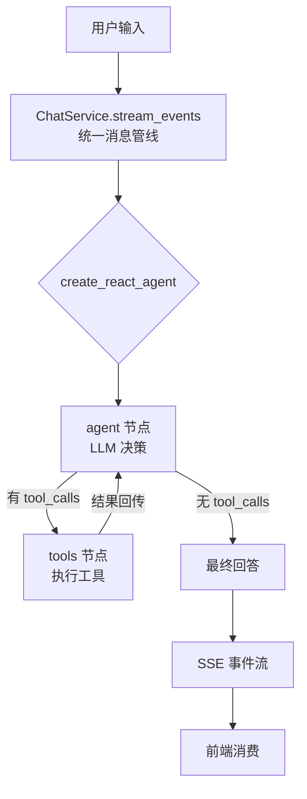

<div align="center">

# Private Agent

**本地 LLM 驱动的私人知识管家**

长期记忆 &middot; 知识库检索 &middot; ReAct 推理 &middot; SSE 流式输出


</div>

---

##  项目背景

这是一个从零构建的 AI Agent 项目。从最简单的 `if-else` 意图路由开始，在实践中发现问题，学习 **LangGraph ReAct 模式** 后进行全面重构。整个过程体现了从"能跑就行"到"工程化"的成长路径。

---

##  演进历程

### v0.1 &mdash; 打地基

> 用户发消息 &rarr; 猜他想干什么 &rarr; 分发到对应模块

```
用户输入 → detect_intent（规则 + LLM 兜底）→ chat / remember / search → 生成回答
```

技术栈：`FastAPI` `LangGraph` `SQLite` `ChromaDB` `Ollama` `Qwen2.5:7b`

跑了一段时间后，**5 个架构问题**逐渐暴露：

| # | 问题 | 具体表现 |
|:--:|------|----------|
| 1 | **意图检测不可靠** | LLM 输出 `"chat "`（多余空格）或 `"我要聊天"`（整句中文），if-else 路由直接失效 |
| 2 | **双管线各自实现** | `/chat` 和 `/chat/stream` 两套独立代码，修 bug 改两处，SSE 格式不统一 |
| 3 | **CRUD 不完整** | 只能存和查，不支持删除。State 字段在三个文件各自定义一套 |
| 4 | **硬编码 + 无降级** | 模型名写死在代码里，Ollama 挂了直接 500 |
| 5 | **编码兼容** | Windows 下中文乱码，ChromaDB 1.5.9+ API 不兼容 |

> 这些问题在 Demo 里不是问题。但当系统需要处理"先查 Redis 文档，然后记住它的核心配置"这种多意图请求、需要被前端消费、需要稳定运行时，就成了架构债。

---

### v0.2 &mdash; 架构升级

<div align="center">

**不要让代码猜 LLM 想干什么。让 LLM 直接告诉代码要调用哪个函数。**

</div>

研究 LangGraph 文档后学到两个核心模式：

```python
# 1. @tool + bind_tools() — 函数变工具，LLM 输出结构化调用
@tool
def search_knowledge(query: str) -> str:
    """Search private knowledge base."""

# LLM 不再输出模糊字符串，而是输出：
# {"name": "search_knowledge", "args": {"query": "Redis 配置"}}
# 代码只负责执行，不需要解析 LLM 的输出。
```

```python
# 2. create_react_agent — 预构建 ReAct 循环
agent = create_react_agent(
    model=ChatOllama(model="qwen2.5:7b", temperature=0),
    tools=TOOLS,
    state_schema=AgentState,
)
# LLM 在循环中自主决策：
# 需要调工具？→ 调哪个？→ 结果够吗？→ 还需要更多？→ 重复直到完成
```

**新架构：**



**v0.1 &rarr; v0.2 对比：**

| 问题 | v0.1 | v0.2 |
|------|------|------|
| **意图检测** | LLM 输出字符串 &rarr; if-else 路由 | `@tool` + `bind_tools()` &rarr; 结构化 `tool_calls` |
| **聊天管线** | 两套独立代码 | `ChatService.stream_events()` 统一入口 |
| **记忆管理** | 只能存和查 | `save` `list` `delete` `delete_all` 完整 CRUD |
| **模型配置** | 源码硬编码 | `.env` 配置 `settings.ollama_chat_model` |
| **State** | 三个文件各自定义 | 统一 `GraphState`，`AgentState` 别名兼容 |
| **错误处理** | 崩溃 &rarr; 500 | try/except &rarr; `error` SSE 事件 |
| **编码** | Windows 乱码 | UTF-8 with BOM |
| **ChromaDB** | 版本 API 不兼容 | `NotFoundError` + 自定义 Ollama Embedding |

**工程化成果：**

- **157 个测试**（136 单元 + 6 集成 + 7 E2E + 3 性能 + 5 安全），全部通过
- SSE 事件协议文档化：`meta` &rarr; `stage` &rarr; `final` &rarr; `done`
- LangGraph `astream_events v2` 事件映射到自定义 SSE 格式

---

### v0.3 &mdash; 规划中

> 当前 ReAct 的局限：Agent 不会自我审查。引用不存在的文档、格式不对都发现不了。

计划引入 **Reflexion 循环**：Agent 生成 → 审核员指正 → Agent 修正 → 循环直到通过。同时加入被动记忆提取，定期分析对话自动发现用户偏好。

---

##  项目结构

```
private-agent/
├── app/          FastAPI 入口 · ChatService 统一管线
├── agent/        LangGraph ReAct 循环 · @tool 工具定义
├── tools/        知识库检索工具
├── llm/          Ollama HTTP 客户端
├── memory/       SQLite 存储（WAL 模式）
├── rag/          ChromaDB 向量库 · 文档切块 · 本地导入
├── config/       Pydantic Settings 全局配置
├── knowledge/    本地 Markdown 笔记
├── tests/        157 个测试
└── static/       前端 SPA + SSE 客户端
```

---

##  快速启动

```bash
# 1. 拉取模型
ollama pull qwen2.5:7b
ollama pull nomic-embed-text

# 2. 安装依赖
python -m venv venv
source venv/Scripts/activate   # Windows Git Bash
pip install -r requirements.txt

# 3. 导入本地笔记到知识库
curl -X POST http://127.0.0.1:8000/ingest/local \
  -H "Content-Type: application/json" \
  -d '{"directory": "knowledge"}'

# 4. 启动服务
uvicorn app.main:app --reload
# 浏览器打开 http://127.0.0.1:8000
```

---

##  核心设计

### ReAct 推理循环

```python
# agent/graph.py — 模块加载时构建，全局单例
agent = create_react_agent(
    model=ChatOllama(model=settings.ollama_chat_model, temperature=0),
    tools=TOOLS,
    state_schema=AgentState,
)
```

| 节点 | 职责 | 说明 |
|------|------|------|
| **agent** | LLM 决策 | 分析输入 + 对话历史，决定直接回答还是调用工具 |
| **tools** | 执行工具 | 执行 agent 请求的 tool_calls，结果返回 agent |

循环持续直到 LLM 输出不包含 `tool_calls` 的消息（任务完成），或达到 `remaining_steps` 上限。

### 5 个 LLM 可调用工具

| 工具 | 参数 | 底层实现 |
|------|------|----------|
| `search_knowledge` | `query: str` | ChromaDB 向量检索 &rarr; Top-5 &rarr; 格式化为 `[K1]...[K5]` 编号块 |
| `save_memory` | `key`, `value`, `category` | SQLite `INSERT OR REPLACE` |
| `list_memories` | `category?` | SQLite `SELECT` &rarr; 按分类筛选，按更新时间倒序 |
| `delete_memory` | `key` | SQLite `DELETE` &rarr; 返回是否成功 |
| `delete_all_memories` | &mdash; | 遍历删除所有记忆 &rarr; 需用户确认 |

### 统一 SSE 事件流

`ChatService.stream_events()` 是 `/chat` 和 `/chat/stream` 的唯一业务入口：

```json
{"event": "meta",  "data": {"request_id": "uuid", "thread_id": "uuid"}}
{"event": "stage", "data": {"stage": "正在检索知识库...", "message": "查找相关文档"}}
{"event": "final", "data": {"content": "根据你的知识库，Redis 的配置...", "citations": []}}
{"event": "done",  "data": {"request_id": "uuid"}}
```

- `/chat` &rarr; 遍历流，收集 `final`，返回 `{"response": "..."}`
- `/chat/stream` &rarr; 逐条包装为 `data: {json}\n\n`，SSE 推送

### 文档切块策略

```
Markdown 文件 → 按 ## 标题分割 → 超长段落按空行分割 → 超长段落按 300 字窗口（50 字重叠）切割
```

---

##  API

| 方法 | 路径 | 说明 |
|:-----|:-----|:-----|
| `POST` | `/chat` | 同步聊天，返回 JSON |
| `POST` | `/chat/stream` | 流式聊天，SSE 事件流 |
| `POST` | `/memory/remember` | 保存记忆 `{key, value, category}` |
| `GET` | `/memory/list` | 查看记忆 `?category=tech_stack` |
| `DELETE` | `/memory/delete/{key}` | 删除指定记忆 |
| `DELETE` | `/memory/delete-all` | 删除全部记忆 |
| `POST` | `/knowledge/search` | 搜索知识库 `{query, top_k}` |
| `POST` | `/ingest/local` | 导入本地 Markdown/txt 笔记 |
| `GET` | `/health` | 健康检查（含 Ollama 连接状态 + 模型列表） |
| `GET` | `/` | 前端对话界面 |

---

##  测试

```bash
pytest tests/ -v
```

| 类型 | 数量 | 覆盖范围 |
|:-----|:----:|:-----|
| 单元测试 | 136 | 工具函数、存储 CRUD、API 端点、文档切块、文本格式化、Ollama 客户端 |
| 集成测试 | 6 | Agent 管线全流程、多工具协作 |
| E2E 测试 | 7 | 完整对话流程、记忆增删改查、知识库搜索 |
| 性能测试 | 3 | 响应时间、并发请求 |
| 安全测试 | 5 | 空消息、超长输入、特殊字符、无效会话 ID、缺失字段 |

---

##  技术栈

| 层 | 选型 | 说明 |
|:---|:-----|:-----|
| 框架 | **FastAPI** | 原生异步支持，自动生成 OpenAPI 文档 |
| Agent | **LangChain + LangGraph** | ReAct 预构建 Agent，`@tool` 工具绑定，状态管理 |
| LLM | **Ollama · Qwen2.5:7b** | 本地推理，零 API 调用成本 |
| Embedding | **Ollama · nomic-embed-text** | 本地向量化，768 维 |
| 向量库 | **ChromaDB** | 持久化存储，余弦相似度检索 |
| 业务库 | **SQLite** (WAL) | 零配置部署，适合单机场景 |
| 测试 | **pytest** + asyncio | 异步测试支持，fixture 复用 |

---

##  相关文档

- [ARCHITECTURE-v0.2.md](ARCHITECTURE-v0.2.md) &mdash; v0.2 系统架构详解，含 Mermaid 图与 SSE 协议定义
- [ARCHITECTURE.md](ARCHITECTURE.md) &mdash; v0.1 原始架构规划，历史参考
- [TECH_DEBT.md](TECH_DEBT.md) &mdash; 技术债务跟踪与修复路线图

---

<div align="center">
  <sub>MIT License &middot; <a href="https://github.com/zzj024/private-agent">GitHub</a></sub>
</div>
